_This project has been created as part of the 42 curriculum by lgervet_

# Description

```mermaid
sequenceDiagram
    autonumber
    participant C as 🖥️ CLIENT
    participant S as ⚙️ SERVER

    Note over C: Encode string to binary

    loop For every bit in string
        C->>S: Signal SIGUSR1 (Send Bit)
        activate S
        Note right of S: Store bit in array
        S-->>C: Signal SIGUSR2 (Acknowledge)
        deactivate S
        Note left of C: current++
    end

    C->>S: Signal SIGUSR2 (Transmission Complete)
    activate S
    Note right of S: Decode Binary -> ASCII
    Note right of S: Print String
    deactivate S
```

<!-- Section that clearly presents the project, including its goal and a brief overview. -->

Client encodes a str into binary.
Send bit to server with SIGUSR1 bit by bit.
Waits for SIGUSR2 sent by server to acknowledge received bit.
Then proceed with next bit until done.
Server needs to put its data into an array everytime it receives a bit and when done (client with send SIGUSR2) decode binary to ascii char

__CLIENT__
Encode str into binary
Send current with SIGUSR1
__SERVER__
Stocks bit in array
Send SIGUSR2 to say it was received
__CLIENT__
current++
Send current with SIGUSR1
**repeat**

# Instructions
<!-- section containing any relevant information about compilation, installation, and/or execution. -->
## Compilation and execution
`make`
`./server`: shows PID
`./client <server's PID> <string to send>`

## Suject
_[Subject PDF](https://cdn.intra.42.fr/pdf/pdf/185021/en.subject.pdf)_

# Resources
<!-- section listing classic references related to the topic (documentation, articles, tutorials, etc.), as well as a description of how AI was used — specifying for which tasks and which parts of the project. -->

## About signals
 https://sites.uclouvain.be/SystInfo/notes/Theorie/html/Fichiers/fichiers-signaux.html
-> Article on signals and their usage

https://stackoverflow.com/questions/27403641/difference-between-sigusr1-and-sigusr2
-> Difference between SIGUSR1 and SIGUSR2

 https://stackoverflow.com/questions/13477714/how-to-send-signal-sigusr1-and-sigusr2-from-parent-to-children
-> Tip on sending acknowledgment from the server

https://thelinuxcode.com/signal_handlers_c_programming_language/
-> Tips on using signals in C

## About processes
https://www.gnu.org/software/libc/manual/html_node/Processes.html
-> How processes work

https://www.gnu.org/software/libc/manual/html_node/Signaling-Another-Process.html
-> kill() documentation

## About pids
https://www.man7.org/linux/man-pages/man2/getpid.2.html
-> getpid() documentation

<!--
## Some solutions
https://codereview.stackexchange.com/questions/280715/client-server-communications-through-unix-signals-in-c
-> How does it sends bit to server ?

https://medium.com/@beatrizbazaglia/minitalk-6176322eb954
-> Walkthrough
-->
